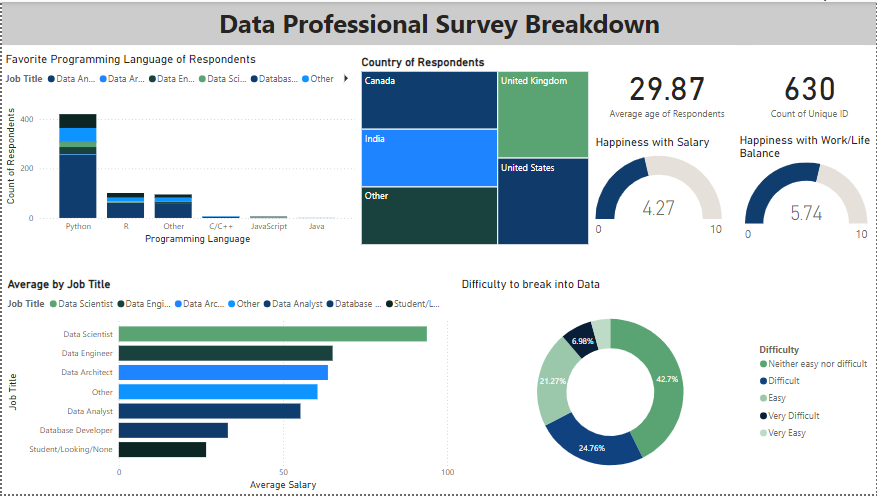

# Data Professional Survey Breakdown Project

This repository contains my progress and analysis for the **Data Professional Survey Breakdown Project**, created using Power BI.

## Project Overview

This project focuses on analyzing data professionals' survey responses, breaking down their demographics, job roles, tools used, and other relevant metrics. It provides insights into the industry trends, salary ranges, and experience levels based on the survey results.

### Key Features of the Power BI Report:
- **Interactive Visualizations:** Multiple charts and graphs for easy interpretation of the survey results.
- **Filters and Slicers:** Allow users to filter data based on job roles, regions, and experience levels.
- **Dynamic Dashboard:** A real-time reflection of the survey data, providing drill-downs into specific categories.

## Progress Documentation

### September 26, 2024
- **Initial Setup:** Imported the survey dataset into Power BI.
- **Data Cleaning:** Removed unnecessary columns, handled missing values, and standardized data formats.
- **Visualizations:** Created the first set of visualizations for job role distribution and salary analysis.

### Challenges:
- Faced issues with inconsistent salary ranges, which were resolved by creating calculated columns for standardized ranges.

### Next Steps:
- Add more filters for geographic region breakdowns.
- Implement time-series analysis for trends over the years.

## Files

- `Data_Professional_Survey_Breakdown_Project.pbix`: The Power BI file containing all the data cleaning steps, visualizations, and dashboards.
- `Power BI Final Project.xlsx`: Dataset of Data Professional Survey
- `images/`: Screenshots of key dashboards and reports.

## Screenshots



## How to Use

1. Clone the repository.
   ```bash
   git clone https://github.com/your-username/Data-Professional-Survey-Breakdown-Project.git
